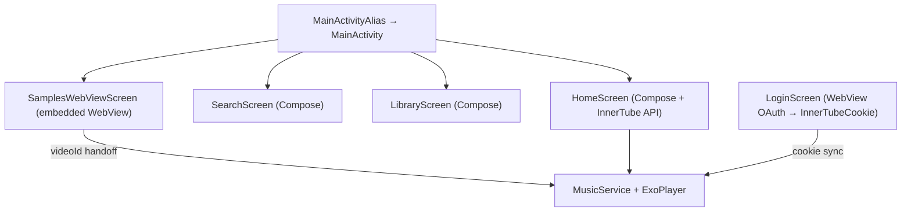

# YT Music (fork de Metrolist)

Personal Android client. Owner: Yang Torres. Goal: look and behave like **official YouTube Music Premium on Android**, not the Windows/desktop site or Metrolist desktop UI. Premium features (no ads, background play, high quality, unlimited skips) are **on by default** — no Upgrade tab, no paywall, no upsell screen.

Repo folder (this is the app to work on):

```
C:\Users\Yang\Development\APKs-Development\Android apps\Android\Metrolist-ytm
```

GitHub: https://github.com/yang532625/yt-music  
Package: `com.yang.ytmusic`  
Launcher name: **YT Music**  
Do not confuse with upstream Metrolist (`com.metrolist.music.debug`). Do not reinstall that package.

Read [HANDOFF.md](HANDOFF.md) first for a short Spanish summary; this file is the full briefing for programming agents.

---

## What this app is now

**Launcher:** `MainActivityAlias` → `com.metrolist.music.MainActivity` (Compose hybrid).

There are **three UI paths** in the same codebase:

| UI | Entry | Status |
|----|--------|--------|
| **Compose hybrid** (current launcher) | `MainActivity` | Home, Search, Library, player, settings |
| **WebView embedded** | `SamplesWebViewScreen` | Samples tab (`/explore`); hands off playback to native player |
| **WebView legacy** | `YtMusicWebActivity` | Rollback path only; **not the launcher** |



Bottom nav (4 tabs only — **no Upgrade**):

- Home → native Compose feed
- Samples → WebView of `https://music.youtube.com/explore`
- Search → native Compose
- Library → native Compose

The user rejected the PC client look (sidebar, giant player overlay, shuffle/seek covering Home). Do not reintroduce an Upgrade tab or Premium marketing screen.

Playback: **native ExoPlayer** via `MusicService` + InnerTube API (`YTPlayerUtils`, PoToken). WebView audio is only for Samples preview; tapping a track pauses web audio and plays through `MusicService`.

Signed-in reference account on Samsung: `yangcyb7@gmail.com`. Emulator is often logged out.

---

## Hard constraints

- Do **not** unzip or copy fonts/icons/assets from Google’s official APK (`com.google.android.apps.youtube.music`). Recreate vectors; screenshots as visual reference only.
- Do **not** edit FreeInternet, iOS, or other apps in the parent `Android` folder unless the user asks.
- Do **not** bump version, commit, or push unless the user asks.
- Do **not** extract secrets. InnerTube cookies live in DataStore (`InnerTubeCookieKey`); WebView cookies in `CookieManager` for login/Samples.
- Custom strings for this fork: `app/src/main/res/values/app_name.xml`. Upstream Weblate file is `metrolist_strings.xml` — do not translate that file for other languages.
- Official YTM on device/emulator is for **screenshots only**.
- Do **not** reintroduce Upgrade tab, Premium upsell UI, or subscription screens.

---

## Agent playbook

Implement and verify on device — do not only document.

1. `adb devices` — use `emulator-5554` for screencaps; Samsung `R5CX40GP43D` for real login/playback.
2. Build: `assembleFossDebug` → `app\build\outputs\apk\foss\debug\app-foss-debug.apk`.
3. Install, force-stop, launch via `MainActivityAlias`.
4. Capture **Home, Samples, Search, Library** plus **now-playing with a song playing**.
5. Compare side-by-side with official YTM on the same device.
6. Fix → rebuild → re-screencap before marking done.

### Build / install

JDK 21:

```
C:\Program Files\Android\Android Studio\jbr
```

SDK: `%LOCALAPPDATA%\Android\Sdk`

```bat
set JAVA_HOME=C:\Program Files\Android\Android Studio\jbr
gradlew.bat assembleFossDebug
```

APK (this fork, not upstream `universalFoss`):

```
app\build\outputs\apk\foss\debug\app-foss-debug.apk
```

Devices:

| Device | Serial |
|--------|--------|
| Samsung S24 Ultra (SM-S928U) | `R5CX40GP43D` |
| Emulator | `emulator-5554` (AVD `Medium_Phone_API_36.1`) |

```bat
adb devices
adb -s emulator-5554 install -r app\build\outputs\apk\foss\debug\app-foss-debug.apk
adb -s emulator-5554 shell am force-stop com.yang.ytmusic
adb -s emulator-5554 shell am start -n com.yang.ytmusic/com.metrolist.music.MainActivityAlias
adb -s emulator-5554 shell screencap -p /sdcard/Download/ytm.png
adb -s emulator-5554 pull /sdcard/Download/ytm.png %TEMP%\ytm.png
```

Samsung (playback/login testing):

```bat
adb -s R5CX40GP43D install -r app\build\outputs\apk\foss\debug\app-foss-debug.apk
adb -s R5CX40GP43D shell am force-stop com.yang.ytmusic
adb -s R5CX40GP43D shell am start -n com.yang.ytmusic/com.metrolist.music.MainActivityAlias
```

Always `force-stop` after install so `MusicService`, PoToken WebView, and embedded Samples WebView pick up new code/JS.

Official YTM for reference (emulator, may be logged out):

```bat
adb -s emulator-5554 shell monkey -p com.google.android.apps.youtube.music -c android.intent.category.LAUNCHER 1
```

Samsung background audio (apply when needed):

```bat
adb -s R5CX40GP43D shell dumpsys deviceidle whitelist +com.yang.ytmusic
adb -s R5CX40GP43D cmd appops set com.yang.ytmusic RUN_ANY_IN_BACKGROUND allow
```

`Govee` (`com.govee.home`) sometimes steals foreground on the phone; force-stop it if screenshots show IoT UI.

---

## Architecture

### Compose launcher (primary)

| File | Role |
|------|------|
| `app/src/main/kotlin/com/metrolist/music/MainActivity.kt` | Shell: bottom nav, top bar, mini-player, player sheet, update dialog |
| `app/src/main/kotlin/com/metrolist/music/ui/screens/Screens.kt` | Tab definitions (Home / Samples / Search / Library) |
| `app/src/main/kotlin/com/metrolist/music/ui/screens/NavigationBuilder.kt` | Nav routes |
| `app/src/main/kotlin/com/metrolist/music/ui/screens/HomeScreen.kt` | Home feed (InnerTube) |
| `app/src/main/kotlin/com/metrolist/music/ui/screens/SamplesWebViewScreen.kt` | Samples WebView + handoff to `MusicService` |
| `app/src/main/kotlin/com/metrolist/music/ui/screens/LoginScreen.kt` | WebView OAuth → `InnerTubeCookieKey` |
| `app/src/main/kotlin/com/metrolist/music/playback/MusicService.kt` | ExoPlayer, MediaSession, background play |
| `app/src/main/kotlin/com/metrolist/music/utils/YTPlayerUtils.kt` | Stream URLs, age/login status handling |
| `app/src/main/kotlin/com/metrolist/music/utils/potoken/PoTokenWebView.kt` | BotGuard / PoToken for playback |
| `app/src/main/kotlin/com/metrolist/music/ui/player/Player.kt` | Full-screen now-playing |
| `app/src/main/kotlin/com/metrolist/music/ui/player/MiniPlayer.kt` | Bottom mini-player |
| `app/src/main/kotlin/com/metrolist/music/ui/player/PlaybackError.kt` | Error overlay in player |
| `app/src/main/kotlin/com/metrolist/music/App.kt` | Loads InnerTube cookie on startup |
| `app/src/main/kotlin/com/metrolist/music/utils/UpdateCoordinator.kt` | GitHub release check + notification |
| `app/src/main/kotlin/com/metrolist/music/utils/UpdateCheckWorker.kt` | Daily update worker (24h) |
| `app/src/main/kotlin/com/metrolist/music/ui/screens/settings/FeedbackScreen.kt` | Email + WhatsApp feedback |

Icon: `drawable/ic_launcher_foreground_yt.xml`, `ytm_logo.xml`, launcher background `#FF0033`.

Feedback contacts (user must tap to send): email `yangcyb7@gmail.com`, WhatsApp `+17866124534`.

### WebView (Samples + legacy)

| File | Role |
|------|------|
| `app/src/main/kotlin/com/metrolist/music/web/YtMusicWebHolder.kt` | WebView setup, ad intercept, JS inject; `embeddedMode` for Samples |
| `app/src/main/assets/ytm_inject.js` | Mobile spoof, ad prune, `__ytmControl`, embedded pause hook |
| `app/src/main/kotlin/com/metrolist/music/web/YtMusicWebActivity.kt` | **Legacy** full WebView shell (rollback only) |
| `app/src/main/kotlin/com/metrolist/music/web/YtMusicPlaybackService.kt` | **Legacy** FGS that owned WebView playback |
| `app/src/main/kotlin/com/metrolist/music/web/YtMusicAdBlock.kt` | Host/path blocklist |
| `app/src/main/kotlin/com/metrolist/music/web/KeepAliveWebView.kt` | Keeps WebView visible for background audio (legacy path) |

---

## What we already did

1. Rebranded Metrolist → YT Music (`com.yang.ytmusic`).
2. Switched launcher to **Compose hybrid** (`MainActivity`): native Home/Search/Library + WebView Samples.
3. Removed **Upgrade** tab — Premium is implicit from first launch.
4. `SamplesWebViewScreen`: embedded WebView with `videoId` handoff to `MusicService` / `YouTubeQueue`.
5. Login via `LoginScreen` (WebView OAuth) → `InnerTubeCookieKey` in DataStore.
6. GitHub updater: `UpdateCoordinator` + `UpdateCheckWorker` (daily check, in-app install).
7. Feedback in Settings → `FeedbackScreen` (email + WhatsApp).
8. Legacy WebView launcher (`YtMusicWebActivity`) kept in repo for rollback, not active.

Earlier WebView-only work (mobile spoof, ad block, native mini-player in legacy path) remains in `web/` for reference.

### Appearance changes (v2 — need more work)

The following changes were applied to make the fork look like official YTM Premium. **They are NOT enough yet — the app still looks more like open-source Metrolist than real YTM.** The next agent must do a thorough visual overhaul.

#### Font
- **Google Sans Flex** (open source, SIL License) bundled in `app/src/main/res/font/`:
  - `google_sans_flex_regular.ttf` (Weight.Normal)
  - `google_sans_flex_medium.ttf` (Weight.Medium)
  - `google_sans_flex_bold.ttf` (Weight.Bold)
- `Type.kt`: `FontFamily.Default` (Roboto) replaced with `GoogleSansFlex` family.

#### Colors (`Theme.kt`)
- `DefaultThemeColor`: `#FF0000` → `#FF0033` (official YTM red)
- `ytmRed`: `#FF0000` → `#FF0033`
- `surfaceContainerHighest`: `#1A1A1A` → `#282828`
- Added `ytmDarkSurfaces()` function for non-pure-black dark mode (surfaces: `#030303`, elevated: `#121212`/`#282828`)
- Dark theme now applies `ytmDarkSurfaces()` by default when theme color is default red

#### Player (`Player.kt`)
- `UseNewPlayerDesignKey`: default `true` → `false` (disables Metrolist red pill button style)
- `PlayerButtonsStyleKey`: default `PRIMARY` → `DEFAULT` (matches YTM button layout)

#### Mini Player (`MiniPlayer.kt` + `Dimensions.kt`)
- `MiniPlayerThumbnailCornerRadius`: `3.dp` → `12.dp` (matches YTM rounded thumbnail)
- Removed Subscribe/AddToPlaylist/Favorite buttons from NewMiniPlayer (YTM doesn't have these in mini player)

#### Navigation Bar (`AppNavigation.kt`)
- Background: `Color.Black` → `Color(0xFF030303)` (official YTM nav bar color)
- Inactive icon alpha: `0.55f` → `0.69f` (matches YTM inactive state)

#### Tests
- `app/src/test/kotlin/com/metrolist/music/ui/YtmAppearanceTest.kt` — 12 unit tests verifying appearance constants
- **NOTE**: The test file has a compilation error (unresolved `dp` reference). It needs fixing: replace `dp.times(Nf)` with `Dp(Nf)` using `androidx.compose.ui.unit.Dp`.

#### Skills (opencode)
- `.opencode/skill/design-qa/SKILL.md` — visual QA skill
- `.opencode/skill/ytm-testing/SKILL.md` — build/test skill

### Remote build execution setup

Builds execute remotely on Windows from a Linux VMware VM via impacket WMI:
- **impacket** installed: `sudo python3 -m pip install --break-system-packages --ignore-installed impacket`
- **WMI exec**: `wmiexec.py Yang:'Lucesita425'@192.168.253.1 "command"`
- **UAC bypass** required first: user must run as Admin in CMD:
  ```
  reg add HKLM\SOFTWARE\Microsoft\Windows\CurrentVersion\Policies\System /v LocalAccountTokenFilterPolicy /t REG_DWORD /d 1 /f
  ```
- Build script: `C:\Users\Yang\Development\build-now.bat` (set JAVA_HOME, run `gradlew assembleFossDebug`)
- Test script: `C:\Users\Yang\Development\run-tests.bat`

### What's NOT done yet (PRIORITY)

**The app still looks more like Metrolist than official YTM.** The changes above were superficial. The next agent must:

1. Compare screenshots of this fork vs official YTM side-by-side on the Samsung phone
2. Identify ALL remaining visual differences (Home feed layout, chip styles, section headers, card sizes, spacing, etc.)
3. Make the app visually indistinguishable from official YTM Premium Android
4. Fix the test compilation error (`dp` reference in YtmAppearanceTest.kt)
5. Verify the GitHub updater actually detects new releases (push a release, check if app picks it up)
6. Bump version if needed for the updater test

---

## Known errors — diagnose and fix

### A. Playback blocked (critical on Samsung)

| Symptom | Likely cause | Key files |
|---------|--------------|-----------|
| `Sign in to confirm you're not a bot` | Missing/expired InnerTube cookie; PoToken failed | `LoginScreen.kt`, `App.kt` (`InnerTubeCookieKey`), `YTPlayerUtils.kt`, `PoTokenWebView.kt` |
| `IO_UNSPECIFIED (2000)` | Invalid stream URL; ExoPlayer recovery path | `MusicService.kt`, `PlaybackError.kt` |
| Home shows "Sign in to see your YouTube Music recommendations" | Not logged in to InnerTube | Profile → Login; reference account on Samsung: `yangcyb7@gmail.com` |
| Age-restricted / `LOGIN_REQUIRED` | InnerTube status not handled in UI | `PlaybackError.kt`, `YTPlayerUtils.kt` |
| Job cancelled (transient) | YouTube playback job failed to start | `PlaybackError.kt` (already has retry path) |

**Expected fixes (priority order):**

1. Detect "bot" error in `PlaybackError` and show **Sign in** CTA → login route.
2. Verify cookie loaded at startup in `App.kt`.
3. Prewarm PoToken on cold start if playback fails without token.
4. (Optional) Sync WebView cookies from Samples/login into InnerTube if user is already signed in on web.

### B. Samples / WebView

| Symptom | Key files |
|---------|-----------|
| Tap on track does not play in native player | `SamplesWebViewScreen.kt`, `YtMusicWebHolder.kt`, `ytm_inject.js` |
| Double audio (web + ExoPlayer) | `embeddedMode` + `__ytmControl('pause')` in inject JS |

### C. Updater

| Symptom | Key files |
|---------|-----------|
| Does not detect GitHub release | `UpdateCoordinator.kt`, `UpdateCheckWorker.kt` |
| Do not bump version or push unless Yang asks | — |

---

## Appearance — checklist vs official YTM Android

Goal: **YouTube Music Premium on Android 2026**, not Metrolist desktop or mobile web.

| Screen | Current issue | Files to change |
|--------|---------------|-----------------|
| **Bottom nav** | Correct (4 tabs); do not re-add Upgrade | `Screens.kt`, `MainActivity.kt` |
| **Home** | "Sign in…" banner when no cookie; chips/carousels Metrolist-style, not 1:1 YTM | `HomeScreen.kt` |
| **Library** | FAB "New", Liked/Downloaded sections — spacing/icons vs official | `LibraryScreen.kt`, `library/*` |
| **Now-playing** | `UseNewPlayerDesignKey` default `true` → red pill Metrolist button; user wants white circle play, like/dislike, shuffle/repeat like YTM | `Player.kt`, `Thumbnail.kt` |
| **Mini-player** | `UseNewMiniPlayerDesignKey` default `false`; verify art/title/red progress vs official | `MiniPlayer.kt` |
| **Top bar** | "Music" wordmark + avatar; compare with YTM toolbar | `MainActivity.kt` |
| **Samples** | Should look like YTM explore; WebView mobile chrome may leak | `SamplesWebViewScreen.kt`, `ytm_inject.js` |

**Visual prohibitions:**

- No assets extracted from Google’s official APK.
- No desktop player-page overlay on Home.
- No Upgrade tab or Premium upsell UI.

**QA:** screencap this app vs official YTM on the same device, with a song playing in the mini-player.

---

## Legacy WebView bugs (rollback path only)

If Yang asks to revert to `YtMusicWebActivity` as launcher, these apply:

- Home looks like **mobile web**: hamburger, "Open App", carousel arrows, "More".
- Do **not** `display:none` all of `ytmusic-nav-bar` — that blanked the feed.
- Shadow DOM: pierce `ytmusic-nav-bar` / carousels or hide by `aria-label`.
- Legacy mini-player can show black bar if JS metadata is late.
- Avoid tight-interval `injectCss` / `pierceShadows` (jank).
- Prefer SPA `__ytmGo` over full `loadUrl` on tab switch.

Do not "fix" Compose issues by going back to desktop player overlay or full WebView launcher unless Yang explicitly asks.

---

## Suggested priorities

1. **Visual overhaul to match official YTM Premium** — the current appearance still looks like open-source Metrolist, not real YTM. Compare screenshots on Samsung and fix every difference (Home feed, chips, cards, spacing, sections, player controls, etc.)
2. Playback on Samsung (bot / login / PoToken)
3. Now-playing UI matching official YTM (player controls, like/dislike, shuffle/repeat layout)
4. Home chips/carousels closer to YTM
5. Stable Samples handoff
6. **End-to-end updater validation** — push a GitHub release, verify the app detects it. Fix if broken.
7. Fix test compilation error (`dp` reference in `YtmAppearanceTest.kt`)
8. Clean dead legacy code (`ytm_premium_panel`, unused `premium_*` strings) — only if WebView rollback still works

---

## Environment — dual OS

| Machine | OS | Role |
|---------|-----|------|
| Windows PC (192.168.253.1) | Windows | Android SDK, Gradle, phone USB connection, GitHub CLI |
| Linux VM (VMware) | Ubuntu 24.04 | impacket WMI remote execution, code editing, git |

### Remote execution from Linux to Windows

```bash
# Basic command execution
wmiexec.py Yang:'Lucesita425'@192.168.253.1 "whoami"

# Run build (background)
wmiexec.py Yang:'Lucesita425'@192.168.253.1 "start /min cmd /c C:\Users\Yang\Development\build-now.bat"

# Check build output
cat "/home/yang/pc/C/Users/Yang/Development/build-output.txt"
```

### CIFS mounts (read/write to Windows filesystem)

| Windows Share | Mount Point | Access |
|--------------|-------------|--------|
| `//192.168.253.1/pc-C` | `/home/yang/pc/C` | Read/write (limited — Desktop, Startup read-only) |
| `//192.168.253.1/pc-D` | `/home/yang/pc/D` | Read/write |
| `//192.168.253.1/tech-empire` | `/home/yang/projects/tech-empire-windows` | Read/write |

Phone: Samsung S24 Ultra, serial `R5CX40GP43D`, connected via USB to Windows.

---

## Upstream Metrolist notes

Compose `MainActivity` **is the launcher** for this fork. When editing upstream-derived code:

- Default English strings for upstream-only features: `app/src/main/res/values/metrolist_strings.xml`
- Do not change Room database schema unless the user asks
- Tabs defined in `Screens.kt`: Home / Samples / Search / Library (no Upgrade)
- Audio quality / downloads: `YTPlayerUtils.kt`, `DownloadUtil.kt`
- Appearance toggles: `UseNewPlayerDesignKey`, `UseNewMiniPlayerDesignKey` in `PreferenceKeys.kt`

The user wants the app to **look and behave like Android YTM Premium**, not a return to full WebView wrapper unless they say so.
